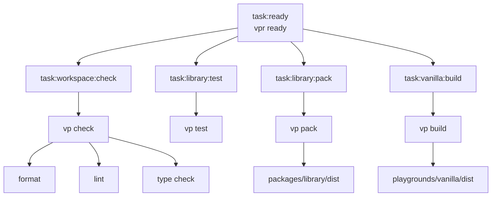

# vp-monorepo

A minimal [Vite+](https://viteplus.dev/) monorepo template for publishable [TypeScript](https://www.typescriptlang.org/) packages, package-local tooling, playground consumers, [Changesets](https://github.com/changesets/changesets), [GitHub Actions](https://docs.github.com/en/actions), and scoped issue/PR workflows.

This template is intentionally thin. It includes one starter library package, one vanilla playground consumer, shared workspace tooling, release configuration, CI, and GitHub planning templates without adding a full example product.

## Template Setup Checklist

When using this template for a real project:

- [ ] Update the root `package.json` name.
- [ ] Update `@scope/library`.
- [ ] Update `@scope/playground-vanilla`.
- [ ] Update package descriptions and keywords.
- [ ] Update package repository URLs.
- [ ] Update `.changeset/config.json` repo name.
- [ ] Update GitHub workflow names or paths if the project layout changes.
- [ ] Set up GitHub branch protection rules for `main` and require the Ready workflow before merging.
- [ ] Update issue templates if the project needs different planning prompts.
- [ ] Replace the starter library API.
- [ ] Replace the vanilla playground smoke test.
- [ ] Remove or change `private: true` before publishing packages.
- [ ] Configure npm trusted publishing before enabling real package publishing.
- [ ] Update this README for the real project.
- [ ] Run `vpr fmt`.
- [ ] Run `vpr ready`.

## Stack

- [TypeScript](https://www.typescriptlang.org/)
- [Vite+](https://viteplus.dev/)
- [Vite+ monorepo workflow](https://viteplus.dev/guide/monorepo)
- [Vite+ task runner](https://viteplus.dev/guide/run)
- [Vite+ package builds](https://viteplus.dev/guide/pack)
- [Vitest](https://vitest.dev/) through Vite+
- [OXC](https://oxc.rs/) linting and formatting through Vite+
- [pnpm workspaces](https://pnpm.io/workspaces)
- [pnpm catalogs](https://pnpm.io/catalogs)
- [Changesets](https://github.com/changesets/changesets)
- [GitHub Actions](https://docs.github.com/en/actions)
- [GitHub issue forms](https://docs.github.com/en/issues/tracking-your-work-with-issues/configuring-issues/configuring-issue-templates-for-your-repository)
- Vanilla [Vite](https://vite.dev/) playground

## Requirements

Use the Node version supported by `package.json`.

CI uses Node 24, so Node 24 is the safest local default.

Install dependencies with Vite+:

```sh
vp install
```

## Creating From This Template

Use this repository as a GitHub template for new Vite+ monorepo projects.

You can also create a project from this template with Vite+:

```sh
vp create github:blazeshomida/vp-monorepo
```

After creating a new repository or project from the template, follow the setup checklist above and run:

```sh
vp install
vpr fmt
vpr ready
```

See the [Vite+ create guide](https://viteplus.dev/guide/create) for other template creation options.

## Commands

Vite+ runs package scripts and configured tasks through `vp run`.

The `vpr` command is the shorthand for `vp run`.

```sh
# Format files
vpr fmt

# Lint files
vpr lint

# Run format, lint, and type checks
vpr check

# Run library tests
vpr test

# Build the library package
vpr pack

# Start the library package build in watch mode
vpr dev:library

# Start the vanilla playground
vpr dev:vanilla

# Build the vanilla playground
vpr build:vanilla

# Create a changeset
vpr changeset

# Version packages from changesets
vpr version

# Run the full local readiness check
vpr ready
```

Run `vpr fmt` before `vpr ready` when finalizing changes.

## Project Structure

```txt
packages/
  library/
    src/
      index.ts
      index.test.ts
    package.json
    tsconfig.json
    vite.config.ts

playgrounds/
  vanilla/
    src/
      main.ts
      styles.css
    index.html
    package.json
    tsconfig.json
    vite.config.ts

tooling/
  format.ts
  lint.ts
  patterns.ts
  tasks.ts

.github/
  workflows/
    ready.yml
    release.yml
  ISSUE_TEMPLATE/
    bug_report.yml
    config.yml
    feature_request.yml
    task.yml
  pull_request_template.md

.changeset/
  config.json

AGENTS.md
README.md
package.json
pnpm-workspace.yaml
tsconfig.json
tsconfig.base.json
vite.config.ts
```

## Workspace Layout

This template separates package code, playground code, and shared tooling:

- `packages/library` is the starter publishable package.
- `playgrounds/vanilla` is a browser consumer for the package.
- `tooling` owns root Vite+ formatting, linting, task, and pattern configuration.
- `.changeset` owns package versioning and release intent.
- `.github` owns CI, release, pull request, and issue templates.
- `AGENTS.md` owns repo-specific instructions for coding agents.

The root `vite.config.ts` is the workspace composition point.

Package-specific and playground-specific behavior stays in the nearest `vite.config.ts`.

```txt
vite.config.ts
packages/library/vite.config.ts
playgrounds/vanilla/vite.config.ts
```

See the [Vite+ monorepo guide](https://viteplus.dev/guide/monorepo).

## Package

The starter package lives in:

```txt
packages/library
```

It exports a small public API:

```ts
export interface GreetingOptions {
  name: string;
}

export function createGreeting(options: GreetingOptions): string {
  return `Hello, ${options.name}.`;
}
```

The package is intentionally marked private:

```json
{
  "private": true
}
```

Remove `private` or set it to `false` before publishing a real package.

### Package Build

The package build is owned by `packages/library/vite.config.ts`.

```ts
export default defineConfig({
  pack: {
    entry: ["src/index.ts"],
    dts: true,
    exports: true,
    format: ["esm"],
    sourcemap: true,
  },
});
```

Build the package with:

```sh
vpr pack
```

This runs:

```txt
task:library:pack
```

and writes package output to:

```txt
packages/library/dist
```

Package exports are managed by the package build configuration.

See the [Vite+ pack guide](https://viteplus.dev/guide/pack).

### Package Tests

Library tests live next to package source:

```txt
packages/library/src/index.test.ts
```

Run tests with:

```sh
vpr test
```

The test imports through the package-local source alias:

```ts
import { createGreeting } from "#/index";
```

## Playground

The vanilla playground lives in:

```txt
playgrounds/vanilla
```

It imports the starter package through the workspace dependency:

```json
{
  "dependencies": {
    "@scope/library": "workspace:*"
  }
}
```

Run the playground with:

```sh
vpr dev:vanilla
```

Build the playground with:

```sh
vpr build:vanilla
```

The playground output is written to:

```txt
playgrounds/vanilla/dist
```

## Import Aliases

Each package or playground owns its own `#/*` alias.

Example:

```json
{
  "compilerOptions": {
    "paths": {
      "#/*": ["./src/*"]
    }
  }
}
```

The alias means:

```txt
#/* = this package or playground's local src/*
```

Do not define `#/*` in the root `tsconfig.base.json`. In a monorepo, root aliases can accidentally point every package at the wrong source tree.

## TypeScript

The root TypeScript config is strict and package-oriented.

The base config intentionally avoids DOM and JSX assumptions. Browser-specific packages and playgrounds opt into DOM types locally.

The template uses:

- `strict`
- `exactOptionalPropertyTypes`
- `noUncheckedIndexedAccess`
- `noImplicitOverride`
- `noPropertyAccessFromIndexSignature`
- `verbatimModuleSyntax`
- `moduleResolution: "bundler"`
- `noEmit`

Package and playground configs extend the root base config.

## File and Folder Conventions

Prefer vertical structure over horizontal structure.

Use the vertical codebase approach as the default reference:

- [The Vertical Codebase](https://tkdodo.eu/blog/the-vertical-codebase)

Group code by feature, domain, package concern, or workflow instead of by technical file type. Code that changes together should usually live together.

Prefer this shape:

```txt
src/
  greeting/
    index.ts
    greeting.ts
    greeting.test.ts
    _format.ts
    _schema.ts
```

Avoid broad dumping grounds unless the package is genuinely tiny or the files are truly global:

```txt
src/
  utils/
  types/
  constants/
  services/
```

Use `_` prefixes for private implementation details inside a vertical.

```txt
src/
  greeting/
    index.ts
    _format.ts
    _schema.ts
    _types.ts
```

Rules:

- `index.ts` is the public boundary for a vertical.
- `_*.ts` files are private to the vertical.
- `_*/` folders are private implementation folders.
- Do not import from another vertical's `_` files.
- Promote code to shared only after at least two real call sites need it.
- Shared code should have a clear name and ownership.
- Avoid vague dumping grounds like `utils`.
- Keep tests near the code they verify.
- Keep types near the code that owns them unless they are part of the public API.

## Tooling

Vite+ owns the local workflow.

Root config:

```txt
vite.config.ts
```

Focused tooling config:

```txt
tooling/format.ts
tooling/lint.ts
tooling/patterns.ts
tooling/tasks.ts
```

### Formatting

Formatting is configured in:

```txt
tooling/format.ts
```

The formatter sorts imports with this shape:

```txt
type imports
built-ins and external packages
#/* project alias imports
relative imports
unknown
```

### Linting

Linting is configured in:

```txt
tooling/lint.ts
```

The lint config enables Vite+ lint rules, type-aware checks, and strict correctness categories.

### Task Inputs

Task input exclusions live in:

```txt
tooling/patterns.ts
```

The shared task input excludes dependency directories, output directories, local cache/temp directories, and generated patterns from Vite+ task cache inputs.

See the [Vite+ run guide](https://viteplus.dev/guide/run).

## Task Graph



## CI

The Ready workflow runs on:

- pull requests
- pushes to `main`
- manual dispatch

It uses [Vite+ CI setup](https://viteplus.dev/guide/ci) with [GitHub Actions](https://docs.github.com/en/actions) to:

1. install dependencies
2. restore the Vite+ task cache and build output
3. run `vp run ready`

The workflow caches:

```txt
node_modules/.vite
node_modules/.vite-temp
packages/*/dist
playgrounds/*/dist
```

Local verification should use:

```sh
vpr fmt
vpr ready
```

## Release Flow

[Changesets](https://github.com/changesets/changesets) is configured for package versioning and release intent.

Create a changeset:

```sh
vpr changeset
```

Apply version changes:

```sh
vpr version
```

Publish packages:

```sh
vpr release
```

The release script runs readiness checks before publishing:

```sh
vp run task:ready && changeset publish
```

The release workflow uses [Changesets Action](https://github.com/changesets/action) to create release pull requests and publish packages from `main`.

Publishing is configured for npm trusted publishing/OIDC by default. Before publishing real packages, configure trusted publishing in npm package settings.

Do not add `NPM_TOKEN` unless the project intentionally switches to token-based npm publishing.

## GitHub Templates

This repo includes:

```txt
.github/pull_request_template.md
.github/ISSUE_TEMPLATE/config.yml
.github/ISSUE_TEMPLATE/bug_report.yml
.github/ISSUE_TEMPLATE/feature_request.yml
.github/ISSUE_TEMPLATE/task.yml
```

Use issue templates to describe scoped work before implementation.

Use the pull request template to record:

- summary
- main changes
- verification
- checklist notes
- follow-up work

See GitHub’s docs on [issue templates and pull request templates](https://docs.github.com/en/communities/using-templates-to-encourage-useful-issues-and-pull-requests/about-issue-and-pull-request-templates).

## Agent Instructions

Repo-specific coding-agent instructions live in:

```txt
AGENTS.md
```

Use `AGENTS.md` for working rules, repository boundaries, verification expectations, and commit guidance.

## Handbook References

This template follows Blaze's handbook for reusable engineering standards.

Primary handbook:

- [Handbook](https://github.com/blazeshomida/handbook)
- [Standards](https://github.com/blazeshomida/handbook/tree/main/standards)
- [Templates](https://github.com/blazeshomida/handbook/tree/main/templates)

Relevant standards:

- [TypeScript](https://github.com/blazeshomida/handbook/blob/main/standards/code/typescript.md)
- [Tooling](https://github.com/blazeshomida/handbook/blob/main/standards/tooling.md)
- [Workflow](https://github.com/blazeshomida/handbook/tree/main/standards/workflow)
